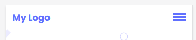
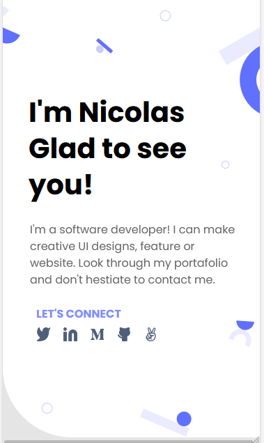
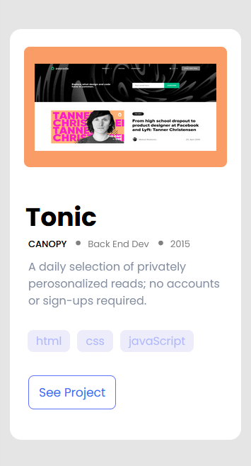
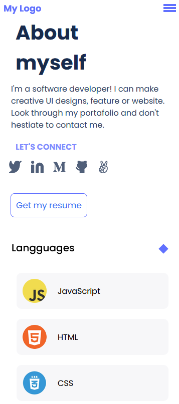
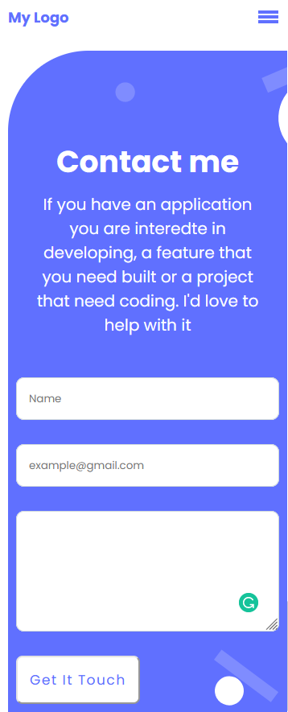

# Mobile_Portfolio_Version

>This is the second Project from the Module-1 'The Portal' using HTML and CSS

>The use of new design tools of different Figma Templates, specifically Microverse template number 1, helps programmers to increase their knowledge and field of work.

>New css properties such as grid and flexbox were used, which were an essential implement for the organization of the project's sections.

## Built with

* HTML - CSS
* GIT/GITHUB
* Figma Templates
* GRID / FLEXBOX

## Project Screenshot

### Project Sections

1. **Toolbar**

2. **Headline**

3. **Work Cards Section**

4. **About Myself Section**

5. **Contact Section**

## Authors

👤 **Nicolas Gonzalez**

-Github: [Github](https://github.com/Nicolaswg)
-LinkedIn: [LinkedIn](https://www.linkedin.com/in/nicolas-gonzalez-8623461a0/)
-Twitter: [Twitter](https://twitter.com/Nicolas54146830)

## Live Page
[Portfolio-webpage](https://nicolaswg.github.io/Nicolas_Microverse_Portfolio/)

## 🤝 Contributing

#### Contributors:
👤 **Kemigabo Catherine**

Contributions, issues, and feature requests are welcome!

Feel free to check the [issues page](https://github.com/Nicolaswg/Nicolas_Microverse_Portfolio/issues)